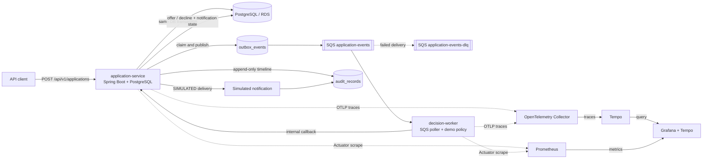

# Cloud-Native Event-Driven Lending Workflow


A small, runnable reference system for a lending workflow that crosses a synchronous API boundary and an asynchronous decision boundary:

```text
submit application → persist + write outbox → publish to SQS → decide asynchronously
  → record an offer or decline → simulate notification → append audit records
```

The project is deliberately synthetic. It demonstrates the engineering seams that are often missing from a Java/REST/SQL portfolio—cloud-shaped deployment, event delivery, idempotency, trace context, retries, dead-letter handling, integration tests, and operational runbooks—without presenting a toy policy as real underwriting or claiming production AWS experience.

## What is implemented

| Area | Implementation |
| --- | --- |
| API and state | `application-service`, Java 21, Spring Boot 4.1, JDBC, PostgreSQL, Flyway |
| Asynchronous decisioning | `decision-worker`, Java 21, Spring Boot, AWS SDK v2 SQS consumer |
| Delivery semantics | Transactional outbox, lease-based publisher, SQS visibility timeout, retry and DLQ redrive |
| Duplicate protection | Request idempotency key + request hash; decision event inbox keyed by event ID |
| Auditability | Append-only audit records for submission, review, offer/decline, and simulated notification |
| Observability | Micrometer metrics, Prometheus endpoint, OpenTelemetry tracing, W3C `traceparent` propagation |
| Local environment | Docker Compose, PostgreSQL, LocalStack SQS, OpenTelemetry Collector, Prometheus, Grafana, Tempo |
| Verification | Maven integration tests with Testcontainers for PostgreSQL and LocalStack |
| AWS shape | Terraform for ECS/Fargate, RDS, SQS/DLQ, ECR, ALB, IAM, CloudWatch logs and alarms |
| Automation | GitHub Actions CI plus explicit `workflow_dispatch` deploy and destroy workflows |

## Architecture



The two services have separate deployable boundaries but share one intentionally narrow callback contract. The worker never writes the application database directly. The application service owns application state, the outbox, the decision inbox, and the audit trail.

The end-to-end sequence is:

1. The client submits an application with an `Idempotency-Key`.
2. `application-service` inserts the application, its `APPLICATION_SUBMITTED` outbox event, and the first audit row in one PostgreSQL transaction.
3. A scheduled publisher claims an outbox row with `FOR UPDATE SKIP LOCKED`, sends the event to SQS, and marks it published. A short lease prevents two publisher ticks from claiming the same row concurrently.
4. `decision-worker` long-polls SQS, starts a consumer span from the event's W3C `traceparent`, evaluates a deterministic synthetic policy, and calls the internal decision endpoint.
5. `application-service` records the event ID in `processed_events`, transitions the application, creates an offer or decline audit row, and records simulated notification delivery in one transaction.
6. Only after the callback succeeds does the worker delete the SQS message. A callback or parsing failure leaves the message visible for retry; after the configured receive limit SQS moves it to the DLQ.

## Reliability contract

This project uses **at-least-once delivery**. SQS can deliver a message more than once, and an outbox publisher can send a message successfully before losing its acknowledgement. The system therefore makes the side effects idempotent:

- The request idempotency key is unique in PostgreSQL and is paired with a SHA-256 request hash. Replaying the same key and payload returns the original application; reusing the key for a different payload returns `409 Conflict`.
- The decision callback records `eventId` in `processed_events`. Replaying the same event and decision is a no-op; reusing an event ID for a different decision is rejected.
- The worker deletes the SQS message only after the callback commits successfully.
- Unsupported or malformed events are treated as failures and are eligible for SQS retry and DLQ redrive.
- The audit table is append-only at the database level. Updates and deletes are rejected by a trigger.

This is not an exactly-once guarantee. Exactly-once side effects are not claimed because the network and queue acknowledgement boundaries still permit duplicates; the design makes duplicate effects safe instead.

The decision policy is only a demo rule: approve when the synthetic credit score is at least `680` and the requested amount is no more than `35%` of annual income. Approved offers use a fixed 36-month term and a deterministic APR tier. It is not a credit model, compliance implementation, fair-lending control, or production underwriting recommendation.

## API walkthrough

The default application service listens on `http://localhost:8080` once the local stack is running (see [Local development](#local-development)).

Submit a synthetic application:

```bash
curl -i -X POST http://localhost:8080/api/v1/applications \
  -H 'Content-Type: application/json' \
  -H 'Idempotency-Key: demo-application-001' \
  -H 'traceparent: 00-4bf92f3577b34da6a3ce929d0e0e4736-00f067aa0ba902b7-01' \
  -d '{
    "applicantReference": "DEMO-001",
    "creditScore": 760,
    "annualIncome": 120000.00,
    "requestedAmount": 25000.00
  }'
```

The first request returns `201 Created` with `status: SUBMITTED`. Repeating the exact request with the same key returns `200 OK`, the same application ID, and `replayed: true`. The asynchronous worker normally moves the application to `OFFERED` within a few seconds:

```bash
curl http://localhost:8080/api/v1/applications/<application-id>
```

The response contains the current status, an offer or decline reason, simulated notification status, and the append-only audit timeline. The worker-to-application callback is an internal contract at `POST /internal/v1/decisions` and requires `X-Internal-Token`; it is not part of the public client API.

## Local development

### Prerequisites

- Java 21
- Docker Engine and Docker Compose v2
- PowerShell 7 for the repository smoke script on Windows (the Maven wrapper works on other platforms)

The repository contains a Maven Wrapper, so a globally installed Maven is not required. Testcontainers integration tests require a running Docker daemon.

### Run the complete local stack

```bash
docker compose up --build --wait
```

The Compose stack includes PostgreSQL, LocalStack SQS and its DLQ, both services, an OpenTelemetry Collector, Prometheus, Grafana, and Tempo. Useful endpoints are:

| Endpoint | Purpose |
| --- | --- |
| `http://localhost:8080` | application-service API |
| `http://localhost:8081/actuator/health` | decision-worker health |
| `http://localhost:9090` | Prometheus |
| `http://localhost:3000` | Grafana (`admin` / `local-demo`; anonymous read-only access is enabled locally) |
| `http://localhost:3200` | Tempo |
| `http://localhost:4566` | LocalStack edge endpoint |

Run the repository smoke test to start the stack, submit an application, verify idempotent replay and eventual offer state, inspect metrics, and exercise a malformed-message DLQ path. A successful run removes the stack and its named volumes; pass `-KeepServices` to leave it running for inspection:

```powershell
pwsh -File .\scripts\smoke-test.ps1
# optional: pwsh -File .\scripts\smoke-test.ps1 -KeepServices
```

The script is intentionally separate from the image build so it can be reused in CI. Stop the stack when finished:

```bash
docker compose down --volumes
```

The volume removal above is scoped to this Compose project and removes only synthetic local data.

### Run integration tests without Compose

```powershell
./mvnw.cmd verify
```

The two modules start their own Testcontainers PostgreSQL/LocalStack dependencies. The tests cover duplicate request replay, idempotency conflict, event/application mismatch rejection, trace propagation, successful decision callback, HTTP timeout handling, and retry/redrive to the DLQ. They are integration tests, not evidence of an AWS deployment or a production load test.

## Observability

Both services expose health and Prometheus-compatible metrics through Spring Boot Actuator. Custom meters include outbox publishes/failures/pending backlog, decision processing/failures, and decision latency. The worker creates a consumer span from the W3C `traceparent` carried as an SQS message attribute; the application service creates and records the trace ID in audit rows and propagates the context to the outbox.

The local OTel Collector sends traces to Tempo, while Prometheus scrapes the two Actuator endpoints directly. Grafana is provisioned with both data sources so a reviewer can correlate an application submission, SQS consumer span, callback, and audit record without requiring an external account. The AWS deployment shape sends container logs to CloudWatch and defines queue/DLQ alarms; it does not pretend that a local Grafana dashboard is an AWS-managed observability deployment.

See [docs/OPERATIONS.md](docs/OPERATIONS.md) for the failure signals, retry/DLQ drill, and cleanup runbook.

## AWS deployment shape

Terraform in [`infra/terraform`](infra/terraform) describes a deliberately small demo topology:

- ECS/Fargate services for `application-service` and `decision-worker`.
- An internet-facing ALB for the public application API; the internal decision callback is not exposed by the public listener.
- PostgreSQL on RDS in private subnets.
- Standard SQS application queue plus a DLQ with redrive policy.
- ECR repositories, CloudWatch log groups, task execution/task roles, security groups, and queue alarms.

The default demo topology uses public Fargate subnets with public IP assignment so it can avoid a NAT gateway and its recurring cost; RDS remains private. This is a cost-conscious learning topology, not a production network baseline. Before using it for a real service, place tasks in private subnets behind the ALB, add NAT or VPC endpoints as appropriate, tighten egress, use a managed secret, add autoscaling and stronger network policy, and review the RDS backup/encryption posture.

The deploy and destroy workflows are manual (`workflow_dispatch`) and gated by the `demo` GitHub Environment. They expect an AWS IAM role trusted through GitHub Actions OIDC plus repository/environment configuration described in [docs/OPERATIONS.md](docs/OPERATIONS.md). No long-lived AWS access keys are stored in the workflow. This repository has not been deployed to AWS from this checkout; the workflows are automation artifacts, not deployment evidence.

## CI/CD

`.github/workflows/ci.yml` runs on pushes and pull requests:

1. Verifies the Maven reactor with Java 21 and Testcontainers.
2. Builds the Compose images and runs the smoke test when Docker is available.
3. Runs Terraform formatting and validation when the infrastructure directory exists.

`.github/workflows/deploy.yml` and `.github/workflows/destroy.yml` are explicit manual workflows. Deploy requires the operator to choose the `demo` environment and set the workflow confirmation input to `DEPLOY`; destroy requires `DESTROY`. The deploy job uses short-lived OIDC credentials, builds and pushes immutable commit-tagged ECR images, and applies the Terraform configuration. Destroy runs a reviewable destroy plan before the destroy operation.

The workflows are intentionally not connected to a push-to-production path. A reviewer can inspect, format, and validate the infrastructure without incurring AWS spend.

## Project boundaries and truthful limitations

- All applicant data is fictional and local. Do not insert real PII, credentials, or application secrets into this repository.
- The policy, offer calculation, and notification are deterministic demonstrations only.
- The system uses at-least-once delivery with idempotent side effects; it does not claim exactly-once processing, zero data loss, or legal/compliance readiness.
- No AWS deployment, production incident, capacity result, or cloud cost result is claimed by this repository. Local integration-test evidence is the current verification boundary.
- The Terraform topology is intentionally economical and should be reviewed before any non-demo use.
- Authentication is an internal shared token for the local/demo callback. It is not a replacement for service identity, mTLS, or a production authorization model.

## Resume-ready project bullets

These bullets describe the implementation in this repository and avoid implying production ownership or AWS deployment:

- Built a two-service Java 21/Spring Boot lending workflow that persists applications in PostgreSQL, publishes review events through a transactional outbox to SQS, and records offers, simulated notifications, and append-only audit events.
- Implemented at-least-once reliability semantics with request idempotency keys, event-id deduplication, lease-based outbox publishing, retry visibility, and SQS DLQ redrive; verified the failure path with Testcontainers LocalStack integration tests.
- Added OpenTelemetry/W3C trace propagation across HTTP and SQS boundaries plus Micrometer/Prometheus metrics for outbox delivery, decision failures, and processing latency, with a local Collector/Tempo/Grafana stack for inspection.
- Defined a cost-conscious Terraform deployment shape for ECS/Fargate, RDS, SQS/DLQ, ECR, IAM, ALB, CloudWatch logs, and alarms, and added manual GitHub Actions OIDC deploy/destroy workflows with explicit confirmation gates.

## Repository guide

| Path | Purpose |
| --- | --- |
| [`application-service`](application-service) | Public API, PostgreSQL state, outbox publisher, decision callback, audit timeline |
| [`decision-worker`](decision-worker) | SQS poller, synthetic policy, trace extraction, callback and retry behavior |
| [`contracts`](contracts) | Versioned event contract examples/schemas |
| [`compose.yaml`](compose.yaml) | Local infrastructure and observability stack |
| [`infra/terraform`](infra/terraform) | AWS demo topology and alarms |
| [`scripts`](scripts) | Local smoke and operator helpers |
| [`docs/ARCHITECTURE.md`](docs/ARCHITECTURE.md) | Design decisions and failure boundaries |
| [`docs/OPERATIONS.md`](docs/OPERATIONS.md) | Local/AWS runbook, dashboards, cleanup and incident drills |
| [`.github/workflows`](.github/workflows) | CI, manual deploy, and manual destroy workflows |

## License

MIT. See [LICENSE](LICENSE).
