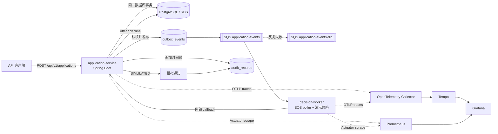

# 云原生事件驱动贷款工作流

简体中文 | [English](README.md)


这是一个规模紧凑、可在本地完整运行的贷款流程参考项目，用虚构数据演示同步 API 与异步决策边界如何协作：

```text
提交申请 → 持久化并写入 outbox → 发布到 SQS → 异步审核
  → 生成 offer 或拒绝结果 → 模拟通知 → 追加审计记录
```

项目的目的不是堆叠技术关键词，而是为 Java、REST、SQL 和 FinTech 经历补充可执行的 cloud、distributed/event-driven systems、observability、testing 和 CI/CD 证据。审核规则完全是演示逻辑，本项目不声称真实承保能力、生产 AWS 经验或合规就绪。

## 交互式动画演示

[打开中文演示](https://kennyufish.github.io/cloud-native-lending-workflow/?lang=zh) · [English demo](https://kennyufish.github.io/cloud-native-lending-workflow/)

[`site/`](site/) 是本仓库独立的网页首页，提供中英文动画，展示申请流转、重复请求、回调重试和死信队列。无需启动 Java 后端，可单独发布为本仓库的 GitHub Pages 网站。预览和发布步骤见 [网页说明](docs/DEMO.md)。

## 已实现能力

| 领域 | 实现 |
| --- | --- |
| API 与状态 | `application-service`、Java 21、Spring Boot 4.1、JDBC、PostgreSQL、Flyway |
| 异步决策 | `decision-worker`、Java 21、Spring Boot、AWS SDK v2 SQS consumer |
| 投递语义 | Transactional outbox、租约式 publisher、SQS visibility timeout、重试和 DLQ redrive |
| 重复保护 | 请求幂等键 + 请求哈希；以 event ID 为主键的 decision inbox |
| 可审计性 | 覆盖提交、审核、offer/拒绝和模拟通知的 append-only 审计时间线 |
| 可观测性 | Micrometer、Prometheus、OpenTelemetry、W3C `traceparent` 传播 |
| 本地环境 | Docker Compose、PostgreSQL、LocalStack SQS、OTel Collector、Prometheus、Grafana、Tempo |
| 测试 | Testcontainers PostgreSQL/LocalStack 集成测试和完整 Compose smoke test |
| AWS 形态 | Terraform：ECS/Fargate、RDS、SQS/DLQ、ECR、ALB、IAM、CloudWatch |
| 自动化 | GitHub Actions CI，以及显式手动触发的 deploy/destroy workflows |

## 架构



两个服务是独立部署边界，但只通过一个狭窄的内部 callback contract 协作。`decision-worker` 不直接写 application 数据库；application 状态、outbox、decision inbox 和审计记录都由 `application-service` 所有。

端到端流程：

1. 客户端携带 `Idempotency-Key` 提交贷款申请。
2. `application-service` 在同一个 PostgreSQL 事务中写入 application、`APPLICATION_SUBMITTED` outbox event 和第一条 audit record。
3. 定时 publisher 使用 `FOR UPDATE SKIP LOCKED` 和短租约认领 outbox row，发送到 SQS 后标记为已发布。网络调用期间不会长期持有数据库锁。
4. `decision-worker` long-poll SQS，从消息属性中的 W3C `traceparent` 继续 trace，执行确定性的虚构决策策略，再调用内部 decision endpoint。
5. `application-service` 原子验证 event 与 application 的归属关系，在 `processed_events` 中去重，并在一个事务内完成状态转换、offer/拒绝、模拟通知和审计记录。
6. worker 只在 callback 成功提交后删除 SQS 消息。解析、HTTP `503` 或超时会保留消息等待重试，达到次数上限后由 SQS 转移到 DLQ。

## 可靠性约定

本项目采用 **at-least-once delivery**，不声称 exactly-once。SQS 可能重复投递；outbox publisher 也可能已经成功发送消息，却在保存发送确认前发生故障。因此系统让副作用具备幂等性：

- `Idempotency-Key` 在 PostgreSQL 中唯一，并与 SHA-256 请求哈希绑定。相同 key 和 payload 返回原 application；相同 key 搭配不同 payload 返回 `409 Conflict`。
- Decision callback 通过 `eventId` 去重，并原子验证 event 确实属于目标 application。相同 event 和 decision 的重放是 no-op；冲突 decision 或错配 application 会被拒绝。
- worker 仅在 callback 成功后删除 SQS 消息。
- callback 设有 1 秒连接超时和 3 秒读取超时，避免依赖服务卡住整个消费循环。
- 不支持或格式错误的事件会进入 retry/DLQ 路径。
- application 与 audit 的读取使用 `REPEATABLE_READ`，避免一个响应混入两个数据库快照。
- `audit_records` 通过数据库 trigger 阻止 UPDATE 和 DELETE。

演示决策规则为：虚构 credit score 至少为 `680`，且 requested amount 不超过 annual income 的 `35%` 时批准；offer 使用 36 个月固定期限和确定性的 APR 档位。这不是信用模型、公平借贷控制、合规实现或真实承保建议。

## API 演示

本地环境启动后，application API 默认位于 `http://localhost:8080`。

提交虚构申请：

```bash
curl -i -X POST http://localhost:8080/api/v1/applications \
  -H 'Content-Type: application/json' \
  -H 'Idempotency-Key: demo-application-001' \
  -H 'traceparent: 00-4bf92f3577b34da6a3ce929d0e0e4736-00f067aa0ba902b7-01' \
  -d '{
    "applicantReference": "DEMO-001",
    "creditScore": 760,
    "annualIncome": 120000.00,
    "requestedAmount": 25000.00
  }'
```

第一次请求返回 `201 Created` 和 `SUBMITTED`。使用相同 key 重复完全相同的请求，会返回 `200 OK`、相同 application ID 和 `replayed: true`。异步 worker 通常会在几秒内把状态变为 `OFFERED`：

```bash
curl http://localhost:8080/api/v1/applications/<application-id>
```

响应包含当前状态、offer 或拒绝原因、模拟通知状态和 append-only audit timeline。`POST /internal/v1/decisions` 是需要 `X-Internal-Token` 的内部接口，不属于公开客户端 API。

## 本地开发

### 前置条件

- Java 21
- Docker Engine 和 Docker Compose v2
- Windows smoke script 需要 PowerShell 7；Maven Wrapper 也可在其他平台使用

仓库包含 Maven Wrapper，不要求全局安装 Maven。Testcontainers 测试需要 Docker daemon 正常运行。

### 启动完整环境

```bash
docker compose up --build --wait
```

本地端点：

| 地址 | 用途 |
| --- | --- |
| `http://localhost:8080` | application-service API |
| `http://localhost:8081/actuator/health` | decision-worker health |
| `http://localhost:9090` | Prometheus |
| `http://localhost:3000` | Grafana；本地登录 `admin` / `local-demo`，同时开放匿名只读 |
| `http://localhost:3200` | Tempo |
| `http://localhost:4566` | LocalStack edge endpoint |

推荐运行一键 smoke test。它会启动环境、提交 application、验证幂等重放和最终 offer、检查 audit/metrics/trace，再发送 malformed message 验证 DLQ。成功后会自动删除本项目的容器和命名卷：

```powershell
pwsh -File .\scripts\smoke-test.ps1
# 保留服务用于检查：pwsh -File .\scripts\smoke-test.ps1 -KeepServices
```

手动关闭环境：

```bash
docker compose down --volumes
```

该命令只清理此 Compose project 的虚构本地数据。

### 单独运行测试

```powershell
.\mvnw.cmd verify
```

两个模块会分别启动 Testcontainers PostgreSQL/LocalStack。当前测试覆盖：

- 幂等请求重放和 payload 冲突；
- event/application 错配拒绝；
- decision callback 去重；
- trace propagation；
- 成功 decision callback；
- HTTP timeout；
- retry 和 DLQ redrive。

这些结果是可复现的本地集成测试证据，不代表 AWS 已部署或生产容量测试。

## 可观测性

两个服务通过 Spring Boot Actuator 暴露 health 和 Prometheus metrics。自定义指标包括：

- outbox publish、failure 和 pending backlog；
- decision processing、failure 和 latency。

worker 从 SQS message attribute 中提取 `traceparent` 并创建 consumer span；application service 把 trace ID 写入 audit record，并继续传播到 outbox。Spring Boot 的自动 instrumentation 还会覆盖 HTTP callback。

本地 OTel Collector 把 traces 发送给 Tempo，Prometheus 直接抓取两个 Actuator endpoint，Grafana 已预配置两个 data source。AWS Terraform 形态则把容器、RDS 和 Container Insights 日志发送到 CloudWatch，并定义 queue/DLQ alarms；本项目不会把本地 Grafana 冒充成 AWS 托管可观测性。

故障信号、retry/DLQ drill 和清理步骤见 [docs/OPERATIONS.md](docs/OPERATIONS.md)。

## AWS 部署形态

[`infra/terraform`](infra/terraform) 描述了一个可销毁、成本受控的演示环境：

- `application-service` 与 `decision-worker` 分别运行在 ECS/Fargate；
- 互联网 ALB 只公开 application API，固定阻断 `/internal*` 和 `/actuator*`；
- PostgreSQL RDS 位于私有子网，启用存储加密，由 RDS 管理 master password；
- SQS Standard queue 使用专属 DLQ、redrive policy 和 managed SSE；
- Cloud Map 提供 worker 到 application service 的私有 DNS；
- ECR 使用 immutable tags、push scanning、lifecycle policy 和 destroy 时 `force_delete`；
- 分离 ECS execution、application task 和 worker task IAM roles；
- callback token 通过 Secrets Manager 注入，并固定具体 secret version；
- ECS、RDS 和 Container Insights log groups 保留 7 天，并配置 DLQ、queue age 和 ECS task alarms。

为了避免 NAT Gateway 的持续成本，默认演示拓扑让 Fargate task 位于公共子网并分配 public IP；RDS 仍保持私有。这是学习和作品集环境，不是生产网络基线。真实系统应把 task 放入私有子网，配置 NAT 或 VPC endpoints、TLS、autoscaling、更严格的 egress、备份策略和 workload identity。

Deploy/destroy workflow 只能通过 `workflow_dispatch` 手动触发，并受 `demo` GitHub Environment 保护：

- Deploy 必须输入 `DEPLOY`；
- Destroy 必须输入 `DESTROY`；
- AWS 凭据来自 GitHub Actions OIDC 短期会话；
- Terraform state 使用外部加密 S3 backend 和原生 lockfile；
- 镜像使用 immutable `sha-<commit>` tag，同一 commit 重跑会复用已有镜像；
- apply 后等待两个 ECS services stable；
- destroy 先生成可审查的 destroy plan。

详细配置见 [docs/OPERATIONS.md](docs/OPERATIONS.md) 和 [infra/terraform/README.md](infra/terraform/README.md)。当前 checkout 从未执行 AWS apply；Terraform 和 workflow 是经过静态验证的部署工件，不是 AWS 部署证明。

## CI/CD

`.github/workflows/ci.yml` 在 push 和 pull request 时执行：

1. 使用 Java 21 和 Testcontainers 验证 Maven reactor；
2. 构建 Compose images 并运行端到端 smoke test；
3. 执行 Terraform formatting、初始化和 validation。

`.github/workflows/deploy.yml` 与 `.github/workflows/destroy.yml` 是带显式确认的手动流程，不存在 push-to-production 自动路径。审阅者可以只运行测试和 Terraform validation，不产生 AWS 费用。

## 已验证结果

最新本地验证：

- Maven reactor：11 个测试，0 failures、0 errors；
- 完整 Compose smoke：申请达到 `OFFERED`，幂等重放、通知和 append-only audit 通过；
- W3C trace 成功跨越 HTTP、outbox、SQS、worker、callback，并可从 Tempo 查询；
- malformed event 成功进入 DLQ；
- application/worker Prometheus custom metrics 可访问；
- Prometheus、Grafana、Tempo readiness 通过；
- Terraform 1.13.5：`fmt -check` 通过，`validate` 为 0 errors、0 warnings；
- GitHub Actions `actionlint` 通过；
- smoke 完成后已删除本项目容器和命名卷。

## 项目边界与诚实声明

- 所有 applicant data 都是虚构数据；不要写入真实 PII、凭据或申请秘密。
- 决策策略、offer 计算和通知都是确定性的演示实现。
- 系统提供 at-least-once delivery 和幂等副作用，不声称 exactly-once、零数据丢失或合规就绪。
- 仓库不声称 AWS 部署、生产事故处理、容量结果或云成本结果；当前证据边界是本地测试和 Terraform/workflow 静态验证。
- Terraform topology 为低成本 demo 设计，任何非演示用途都需要重新审查。
- 内部共享 token 不是 service identity、mTLS 或生产授权系统的替代品。

## 可用于简历的英文描述

以下描述只覆盖本仓库实际实现，不暗示生产所有权或 AWS 已部署：

- Built a two-service Java 21/Spring Boot lending workflow that persists applications in PostgreSQL, publishes review events through a transactional outbox to SQS, and records offers, simulated notifications, and append-only audit events.
- Implemented at-least-once reliability semantics with request idempotency keys, event-id deduplication, lease-based outbox publishing, retry visibility, and SQS DLQ redrive; verified the failure path with Testcontainers LocalStack integration tests.
- Added OpenTelemetry/W3C trace propagation across HTTP and SQS boundaries plus Micrometer/Prometheus metrics for outbox delivery, decision failures, and processing latency, with a local Collector/Tempo/Grafana stack for inspection.
- Defined a cost-conscious Terraform deployment shape for ECS/Fargate, RDS, SQS/DLQ, ECR, IAM, ALB, CloudWatch logs, and alarms, and added manual GitHub Actions OIDC deploy/destroy workflows with explicit confirmation gates.

## 仓库导航

| 路径 | 用途 |
| --- | --- |
| [`application-service`](application-service) | 公开 API、PostgreSQL 状态、outbox publisher、decision callback、audit timeline |
| [`decision-worker`](decision-worker) | SQS poller、虚构策略、trace extraction、callback 和 retry 行为 |
| [`contracts`](contracts) | 版本化 event schema |
| [`compose.yaml`](compose.yaml) | 本地基础设施和可观测性环境 |
| [`infra/terraform`](infra/terraform) | AWS demo topology、IAM 和 alarms |
| [`scripts`](scripts) | 本地 smoke 和操作脚本 |
| [`docs/ARCHITECTURE.md`](docs/ARCHITECTURE.md) | 架构决策和失败边界 |
| [`docs/OPERATIONS.md`](docs/OPERATIONS.md) | 本地/AWS runbook、故障演练和清理流程 |
| [`.github/workflows`](.github/workflows) | CI、手动 deploy、手动 destroy |

## 许可证

MIT，见 [LICENSE](LICENSE)。
